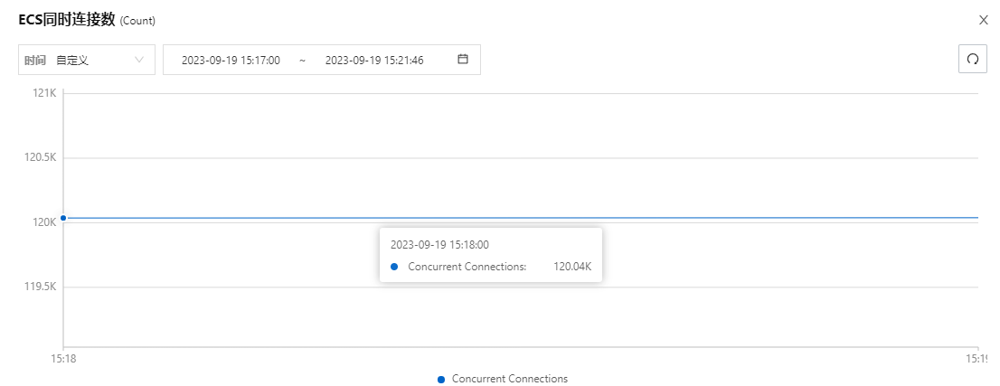

# 💎 Easy MQTT
一款简单、实用、高性能的`MQTT`服务器
## 💪 优势
- 支持集群部署
- 支持数据持久化（从此不再担心服务器宕机导致的订阅关系、消息等数据的丢失）
## 🚩 功能
- [x] 支持MQTT v3.1.1协议
- [x] 支持WebSocket MQTT子协议
- [x] 基于Kvrocks实现数据的持久化及集群
- [x] 完整的QOS服务质量等级实现
- [x] 支持MQTT保留消息
- [x] 支持在建立MQTT连接时通过外部接口进行认证
- [x] 支持以SSL的方式建立TCP/WebSocket连接
- [ ] 遗嘱消息（待实现）
- [ ] 零成本替换阿里云MQTT（待实现）
- [ ] 提供发送消息的api；支持一对一、一对多的方式；支持qos=0、1的等级（待实现）
## 🚀 快速开始

启动kvrocks集群

1.点击 [这里](https://github.com/EasyProgramming/easy-mqtt/releases) 下载最新的已编译的kvrocks压缩包

2.点击 [这里](https://kvrocks.apache.org/docs/getting-started) 阅读官网文档，搭建kvrocks集群

---

启动easy mqtt

1.点击 [这里](https://github.com/EasyProgramming/easy-mqtt/releases) 下载最新的已编译的easy mqtt压缩包

2.将包解压缩后，进入解压缩后的目录，更改conf目录下的配置，然后执行如下命令：
```shell script
sh bin/start.sh -c conf/conf.yml
```
## 🔧 配置项

| 名称                                       | 描述                                                                                     | 默认值                         |
| ----------------------------------------- | ---------------------------------------------------------------------------------------- | --------------------------- |
| mqtt.server.is-use-epoll                  | 是否开启Epoll模式, linux下建议开启                                                           | false                            |
| mqtt.server.is-open-ssl                   | 是否开启ssl                                                                               | false                         |
| mqtt.server.ssl-certificate-password      | SSL密钥文件密码                                                                             |                          |
| mqtt.server.ssl-certificate-path          | SSL证书文件的绝对路径，只支持pfx格式的证书                                                      |                          |
| mqtt.server.tcp-port                      | tcp端口（mqtt协议的端口）                                                                   | 8081                         |
| mqtt.server.websocket-port                | websocket端口                                                                            | 8082                         |
| mqtt.server.api-port                      | api端口                                                                                 |  8083                         |
| mqtt.server.websocket-path                | websocket连接地址                                                                         | /websocket                         |
| mqtt.server.authentication-url            | 认证接口地址，如果为null或空字符串则不鉴权                                                       |                          |
| mqtt.server.listener-pool-size                  | 监听器的线程池大小                                                                         | 核心数*2                         |
| mqtt.server.deal-message-thread-pool-size       | 处理消息线程池的大小                                                                              |  核心数*3                         |
| mqtt.kvrocks.password                          | kvrocks的密码                                                                                   |                           |
| mqtt.kvrocks.cluster.nodes                     | kvrocks节点地址，示例`192.168.2.222:7003,192.168.2.222:7004`                               |                           |
| mqtt.kvrocks.cluster.cluster.max-redirects     | kvrocks集群执行命令时的最大重定向次数                                                           |                          |
| mqtt.kvrocks.pool.min-idle                     | kvrocks连接池中的最小空闲连接数                                                               |   12                         |
| mqtt.kvrocks.pool.max-active                   | kvrocks连接池可以分配的最大连接数。使用负值表示无限制                                            |  12                         |
| mqtt.kvrocks.pool.max-idle                     | kvrocks连接池中的最大空闲连接数。使用负值表示无限制                                             |  12                         |
| mqtt.kvrocks.pool.max-wait                     | kvrocks连接池资源耗尽时，连接尝试分配阻塞时间，超时即抛出异常。使用负值无限期阻塞                     |  -1                         |
| mqtt.kvrocks.pool.time-between-eviction-runs   | kvrocks连接池空闲对象逐出器线程的运行间隔时间。当为正值时，启动空闲对象逐出器线程，否则不执行空闲对象逐出                     |  -1                         |

## 🌞 参考&借鉴
- [mica-mqtt](https://gitee.com/596392912/mica-mqtt)

## 🧾 压测数据

压力机配置：8c16g

---

最大连接数场景

连接数



cpu


内存

12W连接占用内存1.07G

---

发送消息场景

2w个客户端订阅同一个topic，使用另外300个客户端分别向这个topic发送一条qos=1消息，tps=300*2w/处理时间；kvrocks的配置为两台2c4g组成的集群

处理时间为`195s`，tps约为`3w`

ps：若kvrocks集群配置提高，tps可再次提高

## 👍 开源推荐
- `Apache Kvrocks` Apache Kvrocks是一个分布式键值NoSQL数据库，使用RocksDB作为存储引擎，兼容Redis协议：[https://github.com/apache/kvrocks](https://github.com/apache/kvrocks)
